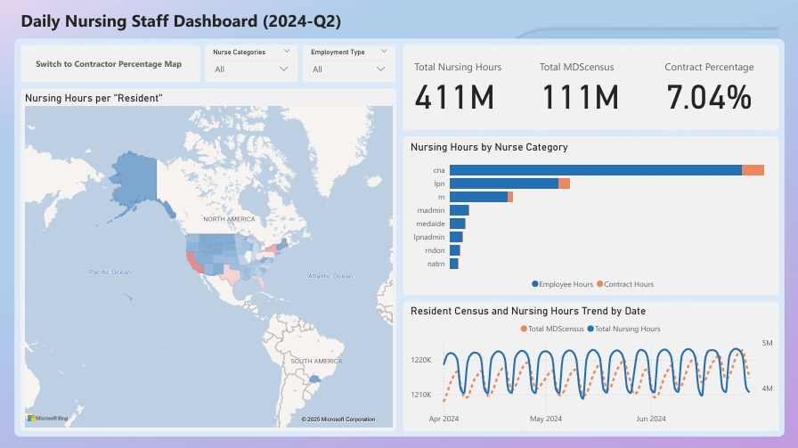
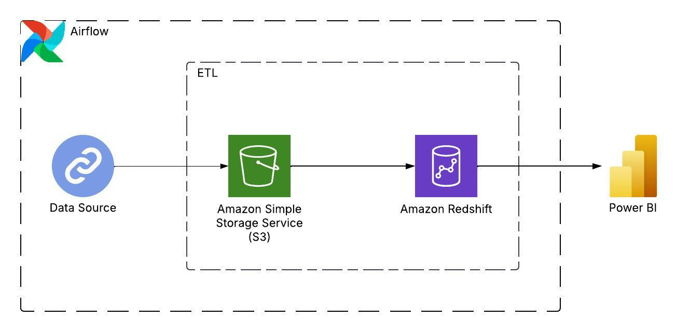

# Nurse Staffing Data Pipeline and Insights for 2024-Q2 Payroll Based Journal

## Table of Contents

- [Project Overview](#project-overview)
- [Architecture](#architecture)
- [Technology Used](#technology-used)
- [Data Sources](#data-sources)
- [Data Model](#data-model)
- [Running the ETL Pipeline](#running-the-etl-pipeline)
- [Summary of Findings](#summary-of-findings)

## Project Overview

This is an exploratory data analysis to help the Nurse Staffing Agency optimize workforce distribution and enhance contract nurse placements across healthcare facilities in the U.S.

The project involved building an **ETL (Extract, Transform, Load) pipeline** to process and analyze work hour data across various nursing categories and states, with a special emphasis on contract nurses.

The analysis was supplemented by an interactive **Power BI dashboard** to visualize staffing trends, state-level variations, and the distribution of contract nurses. The report identifies key trends in 2024-Q2 nurse staffing and provides actionable recommendations for improving staffing allocation, supporting more efficient decision-making and better resource utilization across nursing facilities.


## Architecture



## Technology Used

**Programming Languages**
- Python - Data processing, ETL pipeline, and analysis.
- SQL – Querying and managing structured data.

**Data Engineering & Storage**
- Apache Airflow – Orchestrating ETL workflows.
- AWS S3 – Storing raw and processed data.
- Amazon Redshift – Cloud data warehouse for scalable analytics.

**Visualization & Reporting**
- Power BI – Creating interactive dashboards for analysis.

**Containerization**
- Docker – Containerization for reproducibility.

## Data Sources

Payroll Based Journal Daily Nurse Staffing (2024-Q2): <https://data.cms.gov/data-api/v1/dataset/dcc467d8-5792-4e5d-95be-04bf9fc930a1/data>

More information about the dataset: <https://data.cms.gov/quality-of-care/payroll-based-journal-daily-nurse-staffing>

## Data Model

`staff_raw`: Unprocessed data.

The project follows a Star Schema design to optimize querying and analytics.

### Fact Table

`staff_hours`: Nursing staffing hours data with references to dimension tables.

### Dimension Table

`providers`: Information about healthcare providers.

`resident`: Resident Census from MDS

`date`: Date information.

## Running the ETL Pipeline

### 1. Install the required Python packages
 ```
 pip install -r requirement.txt
 ```
### 2. Set up AWS credentials for S3 and Redshift
Open the `connection.conf` file and fill in your AWS credentials.
### 3. Create S3 bucket and Redshift Cluster
To create an S3 bucket:
 ```
 python create_bucket.py
 ```
To launch a Redshift cluster:
```
python launch_redshift.py
```
### 4. Launch Airflow on Docker
 Airflow is used to orchestrate the ETL pipeline. To get it running on Docker, follow these steps:
 - Initialize the Airflow database:
 ```
 docker compose up airflow-init
 ```
- Start the Airflow services:
 ```
 docker compose up -d
 ```
You can access the Airflow UI at `http://localhost:8080/` with the following login credentials:
 - **Username:** `airflow`
 - **Password:** `airflow`
### 5. Add Connections in Airflow
 Configure the necessary connections in Airflow:
 - **Staffing API Connection**:
 ```
 Connection Id: staffing_api
 Connection Type: HTTP
 Host: https://data.cms.gov/
 ```
- **Redshift Connection**:
 ```
 Connection Id: redshift
 Connection Type: Postgres
 Host: <your redshift endpoint here, example: your-cluster.abc123.us-west-2.redshift.amazonaws.com>
 Datebase: <your redshift database name>
 Login: <your redshift master username>
 Port: 5439
 ```
### 6. Add AWS credentials in Airflow Variable
 - **Key**: `AWS_ACCESS_KEY`  
     **Value**: `<Your_AWS_access_key>`
 - **Key**: `AWS_SECRET_KEY`  
     **Value**: `<Your_AWS_secret_key>`
 - **Key**: `IAM_ROLE_ARN`  
     **Value**: `<Your_IAM_ROLE_ARN>`
 - **Key**: `S3_BUCKET`  
     **Value**: `daily-nurse-staffing-data`
### 7. Trigger DAGs
 Once Airflow is set up, you can trigger the necessary DAGs:
 - **`api_to_s3` DAG:** Extract data from the API and load it into the S3 bucket.
 - **`s3_to_redshift` DAG:** Create the table in Redshift, load data from S3 to Redshift, and transform the original data into the star schema.
### 8. Data Exploration Using SQL Queries
 You can explore the data after loading it into Redshift by running SQL queries.
 - **`sql_query.ipynb`**: This Jupyter notebook contains SQL queries for exploring the data. (Need to configure Redshift connection parameters.)
### 9. PowerBI Dashboard
 `/powerbi_dashboard/dashboard.pbix`: Visualization
### 10. Terminate AWS service
 Make sure to terminate the AWS service to avoid incurring additional costs :)
 ```
 docker compose down --volumes --rmi all
 python delete_bucket.py
 python terminate_redshift.py
 ```

## Summary of Findings

**1. Working Hours Analysis for CNA, LPN, and RN**

Observation: The working hours per resident for CNAs, LPNs, and RNs are notably lower, indicating a shortage of staff in these positions.

Recommendation: Sales team should focus on increasing the recruitment of CNAs, LPNs, and RNs to meet the demand. This can involve enhancing recruitment campaigns, offering competitive salaries, and providing incentives for contract positions.

**2. Low Nurse Working Hours in Missouri, Illinois, and Texas**

Observation: Missouri, Illinois, and Texas exhibit the least nurse working hours per resident.

Recommendation: Targeted recruitment strategies should be implemented in these states to address the shortage. Sales team could consider partnerships with local nursing schools to create a pipeline for contract nurses and explore flexible staffing solutions to cover peak demands.

**3. Weekend Staffing**

Observation: Average working hours on weekends are significantly lower, suggesting a greater need for staff during this time.

Recommendation: Sales team should develop specific weekend bonuses or higher pay rates to attract nurses willing to work during weekends.

**4. High Proportions of Contract Work Hours**

LPNs: States like Vermont (41.04%) and Maine (33.31%) show a higher percentage of contract work hours.

CNAs: Vermont (33.77%) and New Hampshire (17.82%) also exhibit a higher proportion of contract workers.

RNs: States such as Delaware (17.70%) and Oregon (16.79%) have a notable share of contract work hours.

Recommendation: Sales team should focus the recruitment efforts in Vermont, Maine to fulfill the demand for LPNs; increase CNA recruitment efforts in Vermont and New Hampshire; increase RN recruitment efforts in Delaware and Oregon.

**5. Medical Aides in Illinois and New Jersey**

Observation: Illinois and New Jersey show notable contract proportions for medical aides, with values as high as 86.22% and 59.13%, while other states have much lower proportions.

Recommendation: Sales team should leverage the high demand for contract medical aides in these states by promoting the benefits, such as flexibility and competitive pay to attract more candidates.
